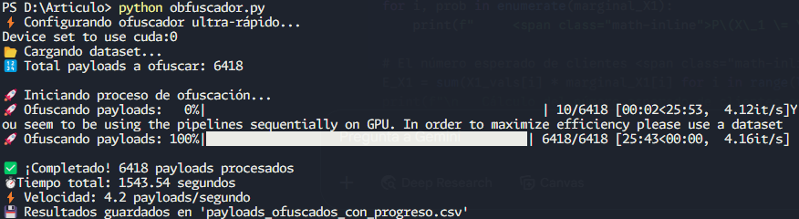

# Implementación: Leveraging LLM to Strengthen ML-Based Cross-Site Scripting Detection



## 📚 Contexto Académico

Este proyecto es una implementación práctica del artículo académico "Leveraging LLM to Strengthen ML-Based Cross-Site Scripting Detection". El objetivo principal es demostrar cómo los modelos de lenguaje (LLMs) pueden ser utilizados para mejorar la detección de ataques Cross-Site Scripting (XSS) mediante la generación de variantes ofuscadas de payloads maliciosos.

## 🎯 Objetivos

- Implementar la metodología propuesta en el artículo para la generación de payloads XSS ofuscados
- Validar la efectividad de los LLMs en la generación de variantes de ataques XSS
- Contribuir al fortalecimiento de los sistemas de detección de XSS basados en Machine Learning

## 🚀 Características Principales

- **Generación de Variantes**: Utiliza el modelo T5 para generar múltiples variantes ofuscadas de payloads XSS
- **Procesamiento Eficiente**: Implementación optimizada con procesamiento en paralelo
- **Integración con ML**: Diseñado para mejorar la robustez de clasificadores de XSS
- **Soporte GPU**: Aprovecha la aceleración por hardware cuando está disponible

## 📋 Requisitos Técnicos

```bash
pip install torch transformers pandas sentencepiece
```

## 💻 Uso

1. Prepara tu dataset en formato CSV con la siguiente estructura:
   ```csv
   payload,label
   <script>alert(1)</script>,1
   <div>Hello World</div>,0
   ```

2. Ejecuta el script de ofuscación:
   ```bash
   python obfuscador.py
   ```

3. Los resultados se guardarán en `payloads_ofuscados_express.csv`

## 🔧 Configuración del Modelo

El script utiliza el modelo T5-small de Hugging Face con los siguientes parámetros configurables:

- `batch_size`: Tamaño del lote para procesamiento (default: 32)
- `max_new_tokens`: Longitud máxima de la salida generada
- `temperature`: Control de aleatoriedad en la generación
- `num_beams`: Número de beams para la búsqueda

## 📊 Ejemplo de Resultados

```
Payload Original: <script>alert(1)</script>
Variantes Generadas:
1. <scr\x00ipt>al\u0065rt(1)</scr\x00ipt>
2. <scr\u0069pt>alert(1)</scr\u0069pt>
3. <scr\u0069\u0070t>alert(1)</scr\u0069\u0070t>
```

## 📝 Referencias

- Artículo Original: "Leveraging LLM to Strengthen ML-Based Cross-Site Scripting Detection"
- Modelo Base: [T5-small](https://huggingface.co/t5-small)
- Framework: [Hugging Face Transformers](https://huggingface.co/docs/transformers/index)

## 🤝 Contribuciones

Las contribuciones son bienvenidas, especialmente aquellas que:
- Mejoren la precisión de la ofuscación
- Optimicen el rendimiento
- Agreguen nuevas funcionalidades alineadas con el artículo

## 📄 Licencia

Este proyecto está bajo la Licencia MIT. Ver el archivo `LICENSE` para más detalles. 